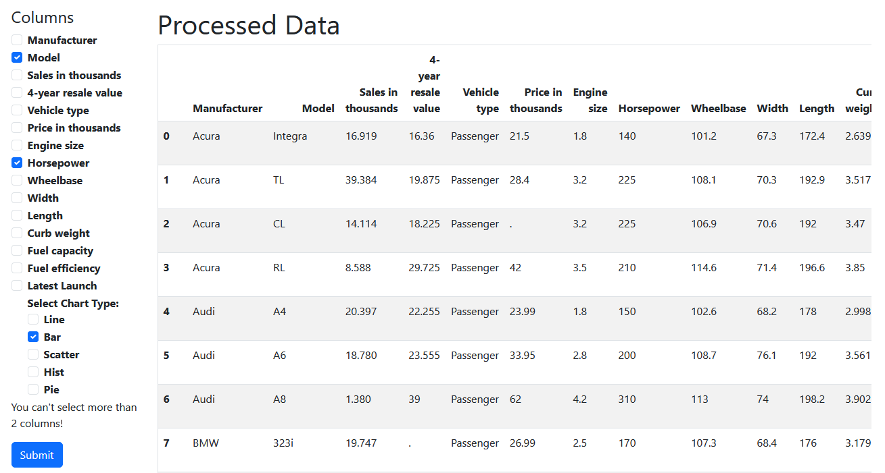
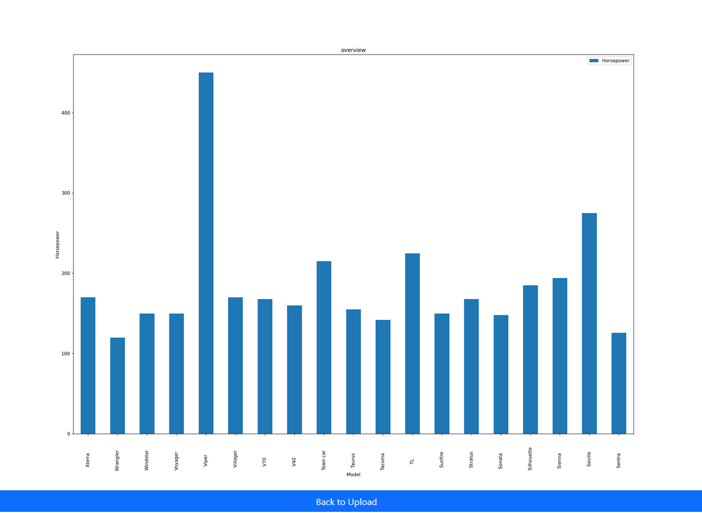

Here’s the markdown code for your README:

```markdown
# Data Analysis App

This is a data analysis application built using Python, FastAPI, pandas, numpy, and matplotlib. The app allows users to
upload CSV files, visualize the data with various charts, and download the results. It serves as a portfolio project to
demonstrate proficiency in data analysis, visualization, and web development.

## Features

- **Upload CSV Files**: Users can upload CSV files for analysis.
- **Data Processing**: The app processes uploaded data using pandas and numpy.
- **Data Visualization**: Users can generate charts based on the data, including line plots, bar charts, and more.
- **Interactive Web Interface**: Built with FastAPI and Jinja2 templates for rendering HTML pages.
- **Chart Generation**: Charts are generated using matplotlib and saved as images, which can be viewed in the app.

## Technologies Used

- **Python**: The core programming language.
- **FastAPI**: Web framework for building APIs and serving the app.
- **pandas**: Data manipulation and analysis.
- **numpy**: Numerical computing.
- **matplotlib**: Plotting and data visualization.
- **Jinja2**: Templating engine for rendering HTML.
- **HTML/CSS**: Frontend for the user interface.

## Installation

1. Clone the repository:

   ```bash
   git clone https://github.com/yourusername/data-analysis-app.git
   cd data-analysis-app
   ```

2. Create a virtual environment:

   ```bash
   python -m venv venv
   ```

3. Activate the virtual environment:

    - On Windows:
      ```bash
      venv\Scripts\activate
      ```
    - On macOS/Linux:
      ```bash
      source venv/bin/activate
      ```

4. Install the dependencies:

   ```bash
   pip install -r requirements.txt
   ```

## Usage

1. Start the FastAPI server:

   ```bash
   uvicorn main:app --reload
   ```

2. Open the app in your browser at `http://127.0.0.1:8000`.

3. Upload a CSV file and select the type of chart you want to generate.

4. View the generated chart and download the results if needed.

## Example

Here is an example of how to use the app:

- Upload a CSV file with columns such as "Model", "Horsepower", and "Price in thousands".
- Select the chart type (e.g., line chart, bar chart) and click "Generate".
- The app will process the data and generate a chart based on the selected columns.
- The chart will be displayed, and you can download the image.

## Example Images

Here are some example charts generated by the app:

### Example 1: Line Chart



### Example 2: Bar Chart



## File Structure

```
data-analysis-app/
│
├── images/                # Directory for example images
│   ├── example_chart1.png
│   └── example_chart2.png
│
├── uploads/                # Directory for uploaded files
├── ds_files/               # Processed data and output images
│   ├── processed_data/     # Processed CSV files
│   └── output-images/      # Generated charts
│
├── app/                    # FastAPI app
│   ├── __init__.py
│   ├── routes.py           # API routes for handling requests
│   └── templates/          # Jinja2 templates for rendering HTML
│
├── requirements.txt        # List of dependencies
├── main.py                 # FastAPI app entry point
└── README.md               # This file
```

## Contributing

Feel free to fork the repository, submit issues, and make pull requests. Contributions are welcome!

[//]: # (## License)

[//]: # ()

[//]: # (This project is licensed under the MIT License - see the [LICENSE]&#40;LICENSE&#41; file for details.)

[//]: # (```)

